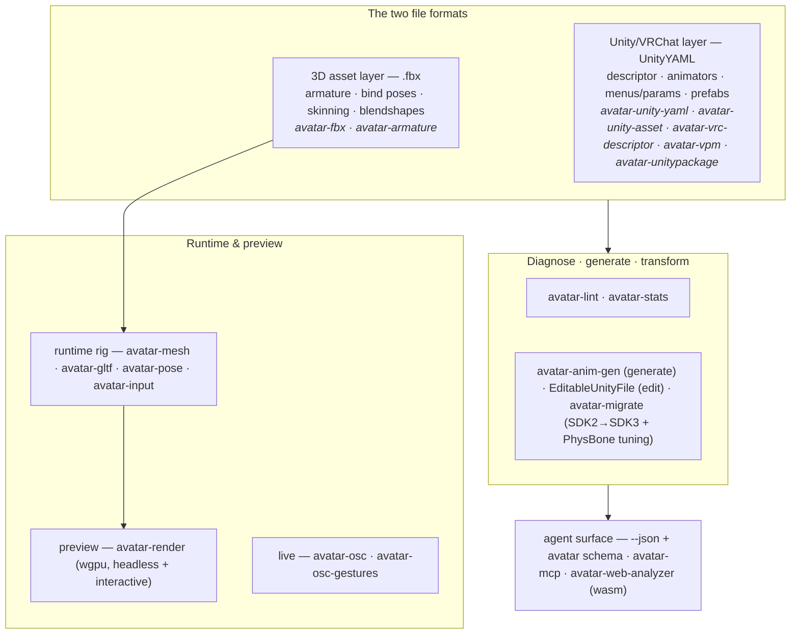

# Overview

These tools work on the *files* a VRChat avatar (Unity, SDK3 / Avatars 3.0) is made of: parse them,
validate them against the VRChat/Unity specs, transform them, and generate new ones — plus a runtime
OSC layer. They do **not** replace Unity or the VRChat SDK upload step.

For the full architecture, crate plan, and roadmap see [`../PLAN.md`](../PLAN.md). For repo-internal
conventions see [`../CLAUDE.md`](../CLAUDE.md). The rendered documentation site (including the
in-browser WebAssembly FBX analyzer) lives at
[andrewaltimit.github.io/avatar](https://andrewaltimit.github.io/avatar/).

## Layers

1. **3D asset layer — `.fbx`** (`avatar-fbx`, `avatar-armature`). The armature/skeleton lives here.
   Binary FBX only; native read **and** write.
2. **Unity/VRChat project layer — UnityYAML** (`avatar-unity-yaml`, `avatar-unity-asset`,
   `avatar-vrc-descriptor`, `avatar-vpm`, `avatar-unitypackage`). Avatar Descriptor, humanoid
   mapping, animators, menus — read/lint, surgical round-trip-safe editing, and packaging.
3. **Logic** (`avatar-lint`, `avatar-stats`, `avatar-anim-gen`, `avatar-migrate`). Diagnostics,
   performance ranking, asset generation, and SDK2 → SDK3 migration with PhysBone tuning.
4. **Runtime & preview** (`avatar-mesh`/`avatar-gltf`/`avatar-pose`/`avatar-input`,
   `avatar-render`, `avatar-osc`/`avatar-osc-gestures`). The renderer-agnostic rig layer, the wgpu
   preview/viewer, and driving avatar parameters over OSC.
5. **Agent surface** (`avatar-mcp`, `avatar-web-analyzer`, `--json` + `avatar schema` everywhere).
   The same tools exposed to agent hosts over MCP and to the browser as WebAssembly.

## Docs map

See [`docs/README.md`](README.md) for the full index: every subsystem has a behaviour reference
under [`reference/`](reference/), and [`tutorial.md`](tutorial.md) is the end-to-end CLI
walkthrough.

## External references

- VRChat: [Avatars 3.0](https://creators.vrchat.com/avatars/), [Rig Requirements](https://creators.vrchat.com/avatars/rig-requirements/),
  [Animator Parameters](https://creators.vrchat.com/avatars/animator-parameters/),
  [OSC overview](https://docs.vrchat.com/docs/osc-overview), [OSC Avatar Parameters](https://docs.vrchat.com/docs/osc-avatar-parameters).
- VPM / Creator Companion: [vcc.docs.vrchat.com](https://vcc.docs.vrchat.com/).
- FBX: [fbxcel](https://github.com/lo48576/fbxcel).
